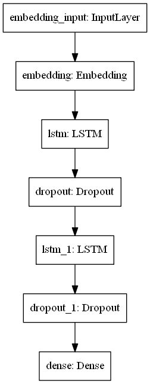
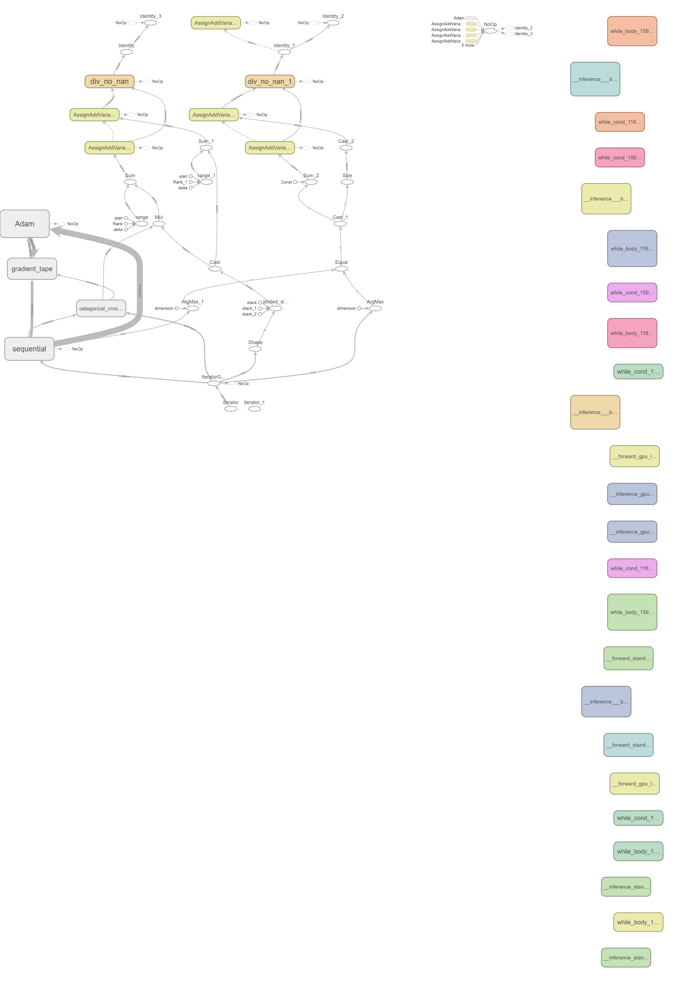
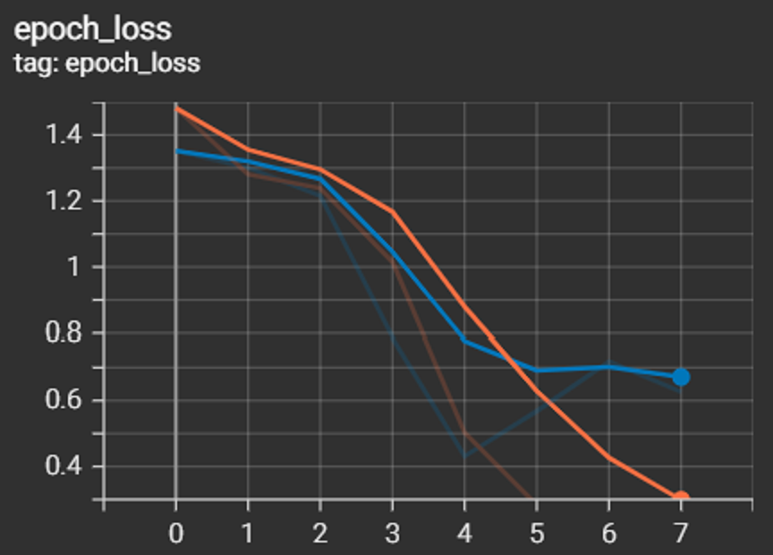
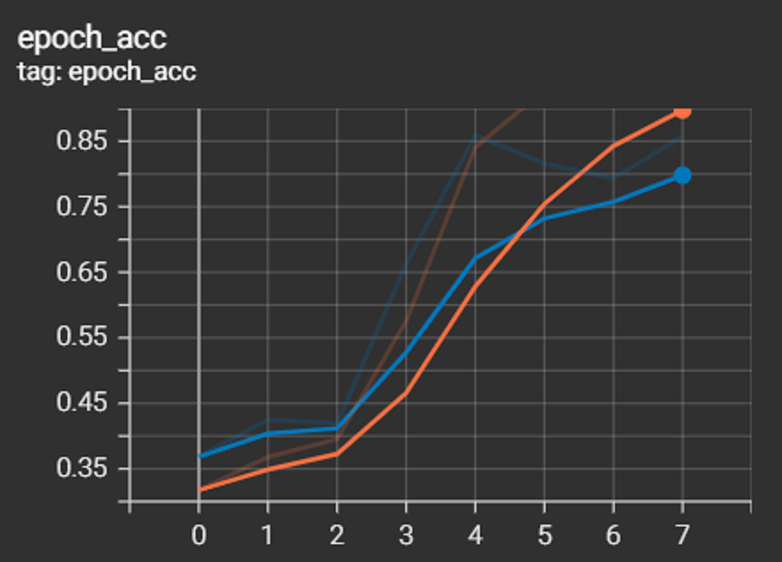
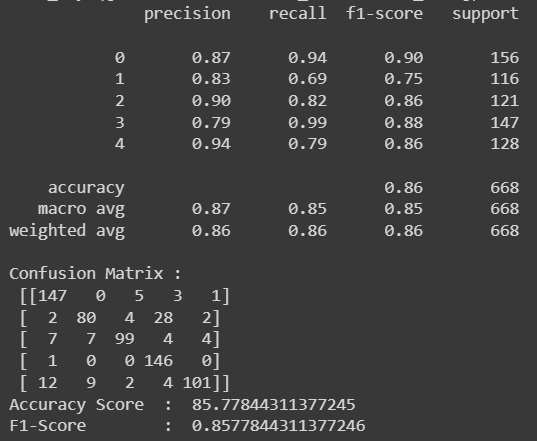

# Article Category Analysis
This project is a part of the assessment for SHRDC Data Science course

#### -- Project Status: [Completed]

## Project Intro/Objective
The purpose of this project is to categorise articles(English)

### Methods Used
* Inferential Statistics
* Deep Learning
* Data Visualization
* Predictive Modeling

### Technologies
* Python
* Pandas, Numpy, Sklearn
* Tensorflow, Tensorboard
* Google Colaboratory

## Getting Started

1. Clone this repo (for help see this [tutorial](https://help.github.com/articles/cloning-a-repository/)).
2. Raw Data is retrieved from [https://raw.githubusercontent.com/susanli2016/PyCon-Canada-2019-NLP-Tutorial/master/bbc-text.csv].
3. Data processing/transformation scripts are being kept [https://github.com/nkayfaith/article_category_analysis/tree/main/saved_model]

## Discussion, Analysis and Result
1. Model Architecture as follows:

A Sequential model with attributes of  embedding_output=128, nodes=64, dropout=0.2, hidden_layer=2 and epochs = 100 with EarlyStopping

2. Training processes recorded as follows:

Process :

Loss :

Accuracy :

3. Performance of the model and the reports as follows:

Both F1 and Accuracy recorded at 

4. Reviews
* Accuracy recorded at 86.67%
* Graph shows high accuracy, low loss which indicates model is good HOWEVER the divergence between the training and validation trends from epoch 5 onwards indicates ovefitting: this occurs if the model has more capacity than is required for the problem.

* Suggestions :
* Reduce number of neurons for the hidden layers
* Set weight regularization
* Use K-Fold Validation

## Credits
https://raw.githubusercontent.com/susanli2016/PyCon-Canada-2019-NLP-Tutorial/master/bbc-text.csv

## Reference
https://machinelearningmastery.com/learning-curves-for-diagnosing-machine-learning-model-performance/
https://www.analyticsvidhya.com/blog/2021/06/complete-guide-to-prevent-overfitting-in-neural-networks-part-1/#:~:text=it%20from%20overfitting.-,Data%20Augmentation,control%20over%20the%20training%20data.
